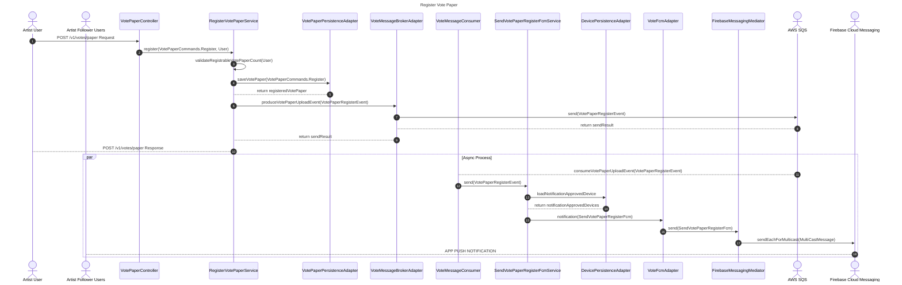

```mermaid
---
title: Register Vote Paper
---
sequenceDiagram
    autonumber
    actor Artist User
    actor Artist Follower Users
    participant VotePaperController
    participant RegisterVotePaperService
    participant VotePaperPersistenceAdapter
    participant VoteMessageBrokerAdapter
    participant VoteMessageConsumer
    participant SendVotePaperRegisterFcmService
    participant DevicePersistenceAdapter
    participant VoteFcmAdapter
    participant FirebaseMessagingMediator
    actor SQS as AWS SQS
    actor FCM as Firebase Cloud Messaging
    Artist User ->> VotePaperController: POST /v1/votes/paper Request
    VotePaperController ->> RegisterVotePaperService: register(VotePaperCommands.Register, User)
    RegisterVotePaperService ->> RegisterVotePaperService: validateRegistrableVotePaperCount(User)
    RegisterVotePaperService ->> VotePaperPersistenceAdapter: saveVotePaper(VotePaperCommands.Register)
    VotePaperPersistenceAdapter --> RegisterVotePaperService: return registeredVotePaper
    RegisterVotePaperService ->> VoteMessageBrokerAdapter: produceVotePaperUploadEvent(VotePaperRegisterEvent)
    VoteMessageBrokerAdapter ->> SQS: send(VotePaperRegisterEvent)
    SQS --> VoteMessageBrokerAdapter: return sendResult
    VoteMessageBrokerAdapter --> RegisterVotePaperService: return sendResult
    RegisterVotePaperService --> Artist User: POST /v1/votes/paper Response
    par Async Process
        SQS --> VoteMessageConsumer: consumeVotePaperUploadEvent(VotePaperRegisterEvent)
        VoteMessageConsumer ->> SendVotePaperRegisterFcmService: send(VotePaperRegisterEvent)
        SendVotePaperRegisterFcmService ->> DevicePersistenceAdapter: loadNotificationApprovedDevice
        DevicePersistenceAdapter --> SendVotePaperRegisterFcmService: return notificationApprovedDevices
        SendVotePaperRegisterFcmService ->> VoteFcmAdapter: notification(SendVotePaperRegisterFcm)
        VoteFcmAdapter ->> FirebaseMessagingMediator: send(SendVotePaperRegisterFcm)
        FirebaseMessagingMediator ->> FCM: sendEachForMulticast(MultiCastMessage)
        FCM --> Artist Follower Users: APP PUSH NOTIFICATION
    end
```