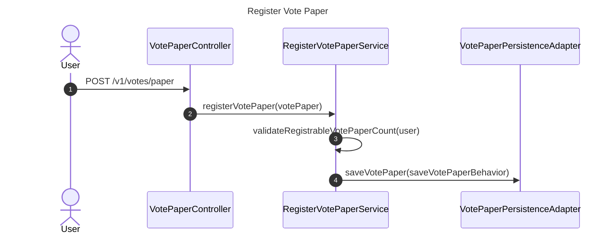

```mermaid
---
title: Register Vote Paper
---
sequenceDiagram
    autonumber
    actor User
    participant VPC as VotePaperController
    participant RVPS as RegisterVotePaperService
    participant VPP as VotePaperPersistenceAdapter
    User ->> VPC: POST /v1/votes/paper
    VPC ->> RVPS: registerVotePaper(votePaper)
    RVPS ->> RVPS: validateRegistrableVotePaperCount(user)
    RVPS ->> VPP: saveVotePaper(saveVotePaperBehavior)
    
```