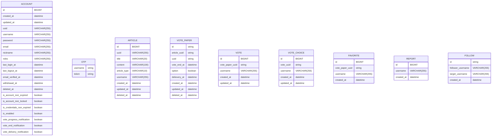

```mermaid
erDiagram
    ACCOUNT {
        id BIGINT
        created_at datetime
        updated_at datetime
        uuid VARCHAR(255)
        username VARCHAR(255)
        password VARCHAR(255)
        email VARCHAR(255)
        nickname VARCHAR(255)
        roles VARCHAR(255)
        last_login_at datetime
        last_logout_at datetime
        email_verified_at datetime
        withdrawal_at datetime
        deleted_at datetime
        is_account_non_expired boolean
        is_account_non_locked boolean
        is_credentials_non_expired boolean
        is_enabled boolean
        vote_progress_notification boolean
        vote_end_notification boolean
        vote_delivery_notification boolean
    }
    OTP {
        username string
        token string
    }
    ARTICLE {
        id BIGINT
        uuid VARCHAR(255)
        title VARCHAR(20)
        content VARCHAR(100)
        article_type VARCHAR(10)
        username VARCHAR(255)
        created_at datetime
        updated_at datetime
        deleted_at datetime
    }
    VOTE_PAPER {
        id string
        article_uuid string
        uuid string
        vote_end_at datetime
        option boolean
        delievery_at datetime
        created_at datetime
        updated_at datetime
        deleted_at datetime
    }
    VOTE {
        id BIGINT
        vote_paper_uuid string
        username VARCHAR(255)
        created_at datetime
        updated_at datetime
    }
    VOTE_CHOICE {
        id BIGINT
        vote_uuid string
        username VARCHAR(255)
        created_at datetime
        updated_at datetime
    }
    FAVORITE {
        id BIGINT
        vote_paper_uuid string
        username VARCHAR(255)
        created_at datetime
    }
    REPORT {
        id BIGINT
        username VARCHAR(255)
        created_at datetime
    }
    FOLLOW {
        id string
        follower_username VARCHAR(255)
        target_username VARCHAR(255)
        created_at datetime
    }
```