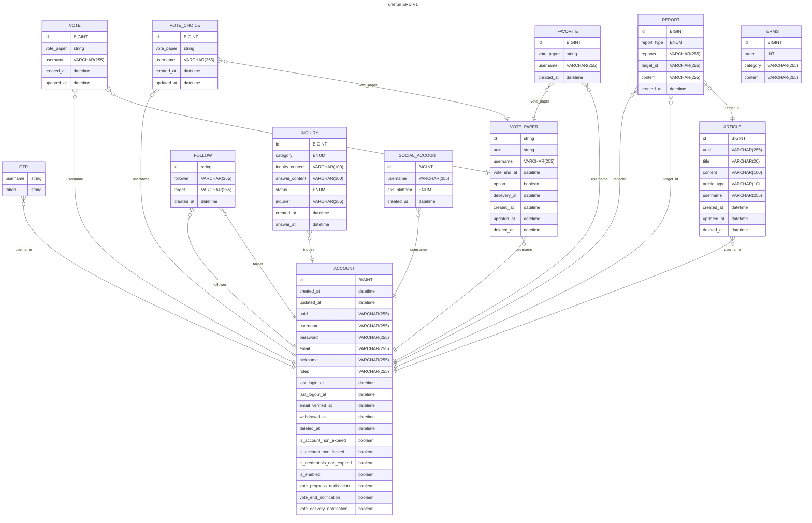

```mermaid
---
title : Tunefun ERD V1
---
erDiagram
    ACCOUNT {
        id BIGINT
        created_at datetime
        updated_at datetime
        uuid VARCHAR(255)
        username VARCHAR(255)
        password VARCHAR(255)
        email VARCHAR(255)
        nickname VARCHAR(255)
        roles VARCHAR(255)
        last_login_at datetime
        last_logout_at datetime
        email_verified_at datetime
        withdrawal_at datetime
        deleted_at datetime
        is_account_non_expired boolean
        is_account_non_locked boolean
        is_credentials_non_expired boolean
        is_enabled boolean
        vote_progress_notification boolean
        vote_end_notification boolean
        vote_delivery_notification boolean
    }
    OTP {
        username string
        token string
    }
    ARTICLE {
        id BIGINT
        uuid VARCHAR(255)
        title VARCHAR(20)
        content VARCHAR(100)
        article_type VARCHAR(10)
        username VARCHAR(255)
        created_at datetime
        updated_at datetime
        deleted_at datetime
    }
    VOTE_PAPER {
        id string
        uuid string
        username VARCHAR(255)
        vote_end_at datetime
        option boolean
        delievery_at datetime
        created_at datetime
        updated_at datetime
        deleted_at datetime
    }
    VOTE {
        id BIGINT
        vote_paper string
        username VARCHAR(255)
        created_at datetime
        updated_at datetime
    }
    VOTE_CHOICE {
        id BIGINT
        vote_paper string
        username VARCHAR(255)
        created_at datetime
        updated_at datetime
    }
    FAVORITE {
        id BIGINT
        vote_paper string
        username VARCHAR(255)
        created_at datetime
    }
    REPORT {
        id BIGINT
        report_type ENUM
        reporter VARCHAR(255)
        target_id VARCHAR(255)
        content VARCHAR(255)
        created_at datetime
    }
    FOLLOW {
        id string
        follower VARCHAR(255)
        target VARCHAR(255)
        created_at datetime
    }
    INQUIRY {
        id BIGINT
        category ENUM
        inquiry_content VARCHAR(100)
        answer_content VARCHAR(100)
        status ENUM
        inquirer VARCHAR(255)
        created_at datetime
        answer_at datetime
    }
    SOCIAL_ACCOUNT {
        id BIGINT
        username VARCHAR(255)
        sns_platform ENUM
        created_at datetime
    }
    TERMS {
        id BIGINT
        order INT
        category VARCHAR(255)
        content VARCHAR(255)
    }
    OTP }o--|| ACCOUNT: username
    ARTICLE }o--|| ACCOUNT: username
    VOTE_PAPER }o--|| ACCOUNT : username
    VOTE }o--|| ACCOUNT: username
    VOTE }o--|| VOTE_PAPER: vote_paper
    VOTE_CHOICE }o--|| ACCOUNT: username
    VOTE_CHOICE }o--|| VOTE_PAPER: vote_paper
    FAVORITE }o--|| VOTE_PAPER: vote_paper
    FAVORITE }o--|| ACCOUNT: username
    REPORT }o--|| ACCOUNT: reporter
    REPORT }o--|| ACCOUNT: target_id
    REPORT }o--|| ARTICLE : target_id
    FOLLOW }o--|| ACCOUNT: follower
    FOLLOW }o--|| ACCOUNT: target
    INQUIRY }o--|| ACCOUNT: inquirer
    SOCIAL_ACCOUNT }o--|| ACCOUNT: username
```
